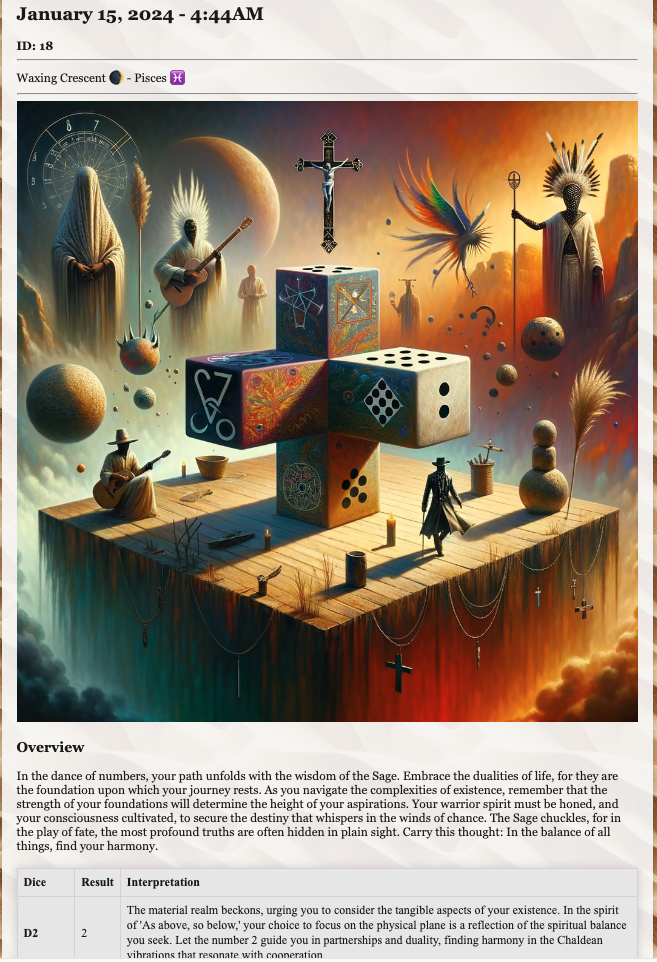

# OpenPair: Dice Divination App


## Project Description

> The Dice Divination App is a web-based server application that processes dice roll results and generates divination readings using OpenAI's ChatGPT. Built with .NET 8.0 and ASP.NET Core, the app leverages numerology and gamatria principles to interpret dice rolls from a D20 dice set.

## Features

- **Dice Roll Processing**: Accepts and processes dice roll results from a D20 dice set.
- **OpenAI ChatGPT Integration**: Communicates with OpenAI's ChatGPT to provide numerological and gamatria interpretations of dice rolls.
- **Divination Interpretation**: Generates insightful readings based on the unique combination of dice rolls.
- **JSON Data Handling**: Efficiently structures and parses JSON data for server-client communication.

| Screenshot 1 | Screenshot 2 |
|--------------|--------------|
|  |  |

## Getting Started

### Prerequisites

- .NET 8.0 SDK or later
- An active OpenAI API key
- ASP.NET Core runtime
- API testing tool like Postman (optional)
- PostgreSQL
- Entity Framework

### Installation

1. **Clone the Repository**:

   ```bash
   git clone https://github.com/MaterDev/OpenPair_DotNet_DiceDivinationApp
   cd OpenPair_DotNet_DiceDivinationApp/DDA_Server
   ```

2. **Set Up OpenAI API Key**:
   - Add your OpenAI API key to the `.env` file.

3. **Restore Dependencies**:

   ```bash
   dotnet restore
   ```

### Database Setup

To set up the database for the Dice Divination App:

1. **Configure the Database Connection**:
   - In the `appsettings.json`, update the connection string under `ConnectionStrings:DefaultConnection` with your database details.

2. **Run Migrations**:
   - In the terminal, navigate to the project directory and run:

     ```bash
     dotnet ef database update
     ```

   - This will apply the migrations and set up your database schema.

### Running the Application

1. **Start the Server**:

   ```bash
   dotnet run
   ```

2. **Test the API**:
   - Use Postman to send dice roll data to the server and receive divination readings.

## License

Distributed under the MDGUL License. See `LICENSE` file for more information.
